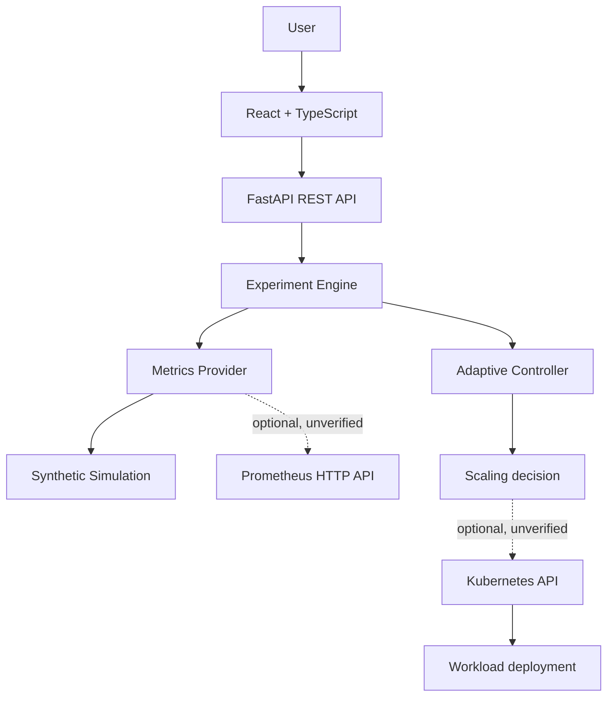

# Architecture

```mermaid
flowchart TD
    User --> Frontend[React + TypeScript]
    Frontend --> Backend[FastAPI REST API]
    Backend --> ExperimentEngine[Experiment Engine]
    ExperimentEngine --> AdaptiveController[Adaptive Controller]
    ExperimentEngine --> MetricsProvider[Metrics Provider]
    MetricsProvider --> Simulation[Synthetic Simulation]
    MetricsProvider -. optional, unverified .-> Prometheus[Prometheus HTTP API]
    AdaptiveController --> HPA[Scaling decision]
    HPA -. optional, unverified .-> Kubernetes[Kubernetes API]
    Kubernetes --> Application[Workload deployment]
```

Simulation results are persisted in SQLite. The optional Prometheus and Kubernetes runtime is packaged separately and remains unverified against the project cluster.
