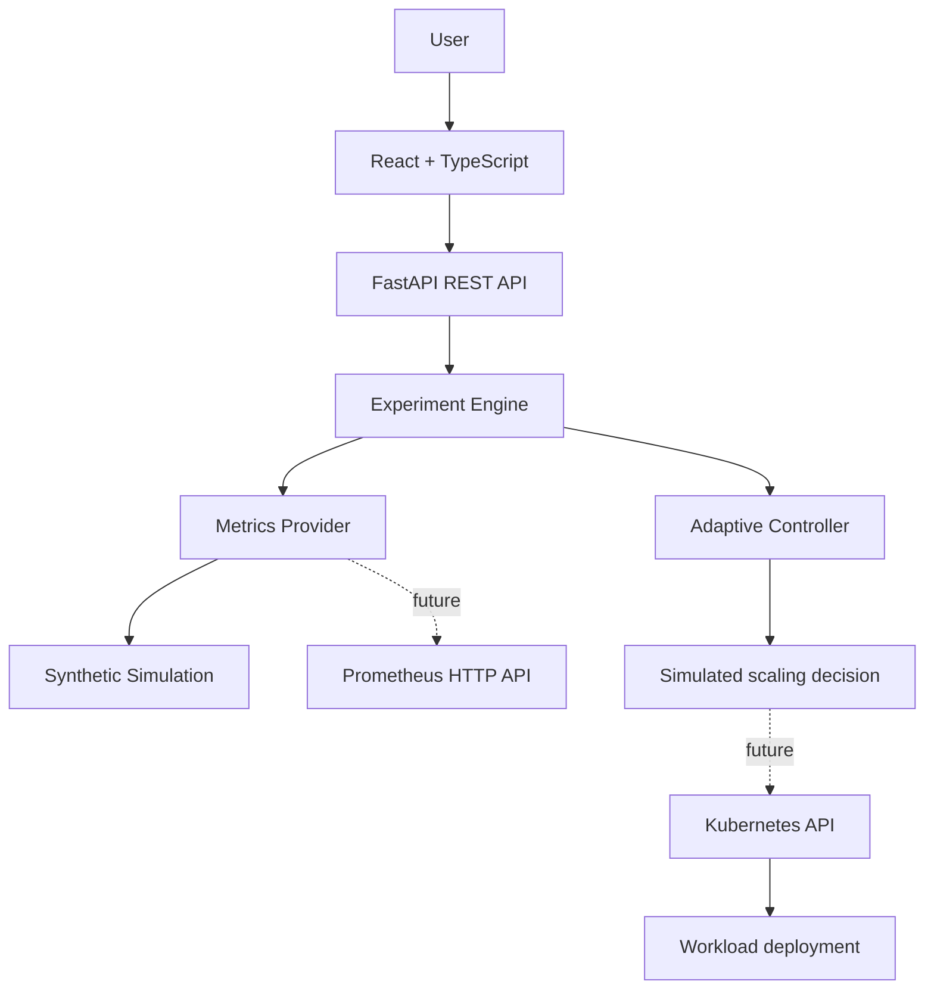

# Architecture

```mermaid
flowchart TD
    User --> Frontend[React + TypeScript]
    Frontend --> Backend[FastAPI REST API]
    Backend --> ExperimentEngine[Experiment Engine]
    ExperimentEngine --> AdaptiveController[Adaptive Controller]
    ExperimentEngine --> MetricsProvider[Metrics Provider]
    MetricsProvider --> Simulation[Synthetic Simulation]
    MetricsProvider -. future .-> Prometheus[Prometheus HTTP API]
    AdaptiveController --> HPA[Simulated scaling decision]
    HPA -. future .-> Kubernetes[Kubernetes API]
    Kubernetes --> Application[Workload deployment]
```

Results are persisted in SQLite. Synthetic mode is the only connected provider in this prototype.
